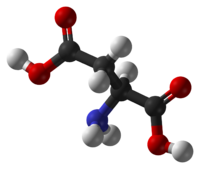
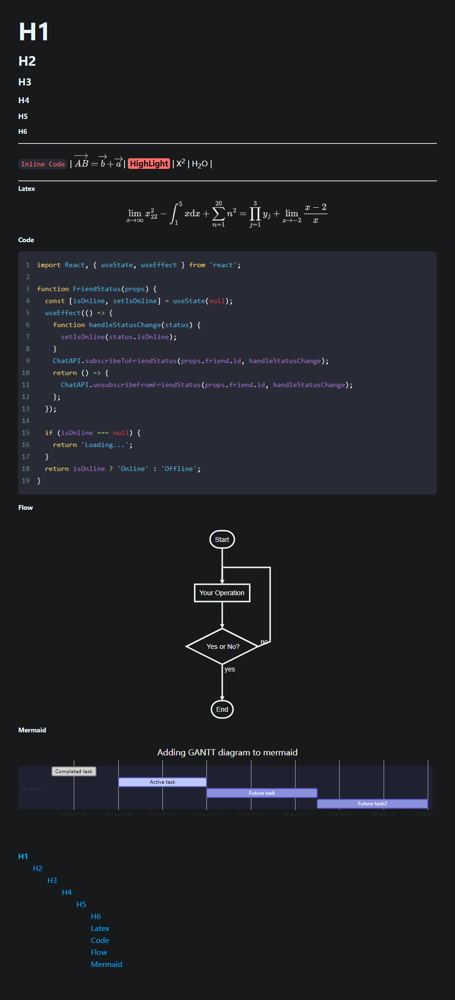
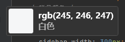
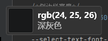
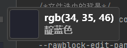
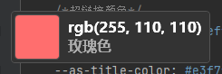
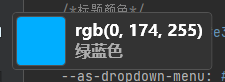
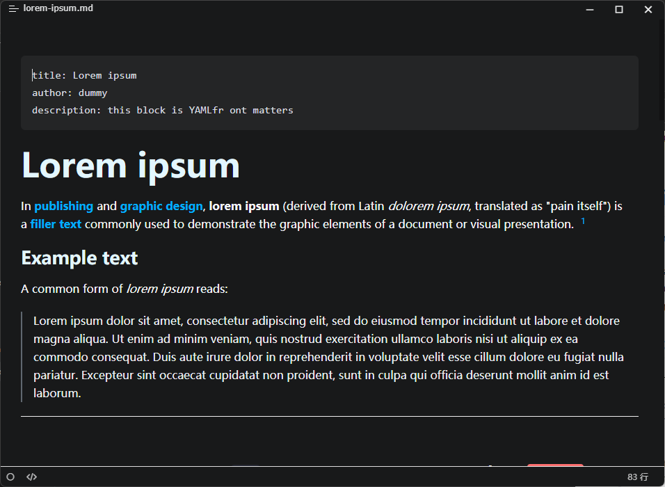
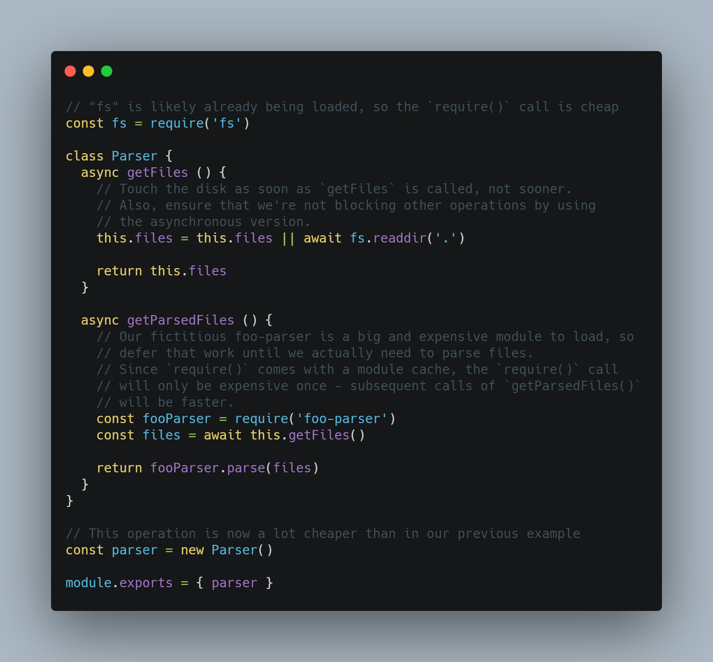

# Aspartate

## 什么是Aspartate

> Aspartate 是一个 [`Typora`](https://typora.io/) 暗色主题。

## Aspartate的制作

`Aspartate`的大部分样式参考了 [这个页面](https://www.electronjs.org/zh/docs/latest/) ；

`CodeMirror`的样式来自 [Carbon](https://carbon.now.sh/?bg=rgba(171%2C+184%2C+195%2C+1)&t=seti&wt=none&l=auto&ds=true&dsyoff=20px&dsblur=68px&wc=true&wa=true&pv=56px&ph=56px&ln=false&fl=1&fm=Hack&fs=14px&lh=133%&si=false&es=2x&wm=false&code=(Typora)%0A(Aspartate)%0A(Theme)) ；

其它的一些样式来自我制作的另一个`Typora`主题:  [Mlike](https://github.com/AntonVanke/typora-mlike-theme) 。

## 截图

## 主题的一些属性

| 属性    | 备注             | 实例图片(非主题图片)                 |
| ------- | ---------------- | ------------------------------------ |
| #f5f6f7 | 字体颜色         |            |
| #18191a | 主体背景颜色     |              |
| #282A36 | 代码块颜色       |   |
| #ff6e6e | 行内代码字体颜色 |  |
| #00aeff | 超链接颜色       |         |
| 950px   | 主体宽度         |                   |
| `Seti`  | `CodeMirror`主题 |             |

## License

> MIT License
>
> Copyright (c) 2021 AntonVanke

## 一些问题

1. 如何安装主题？

   主题文件是`aspartate.css`，移入主题文件夹即可。请查看   [Install Theme](https://theme.typora.io/doc/Install-Theme/)。

2. 导出PDF的问题

   黑色主题在当前版本的`Typora`并不支持导出PDF，请选择其它文件类型导出。如果你希望导出 PDF 可以试试   [AntonVanke/typora-mlike-theme: A typora theme. 一个 Typora 主题 (github.com)](https://github.com/AntonVanke/typora-mlike-theme)

